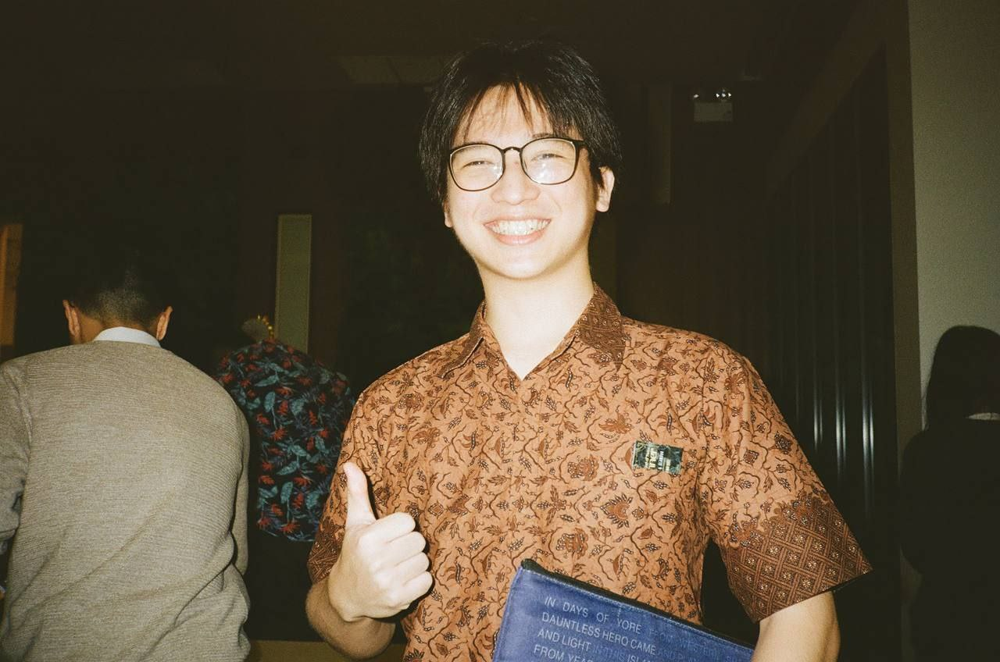
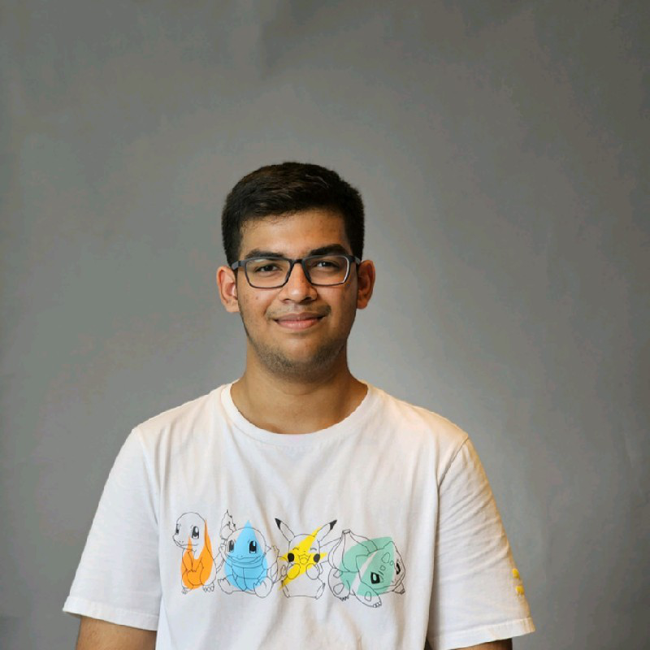

# About Us

We are a team based in the [School of Computing, National University of Singapore](http://www.comp.nus.edu.sg).

You can reach us at the email `seer[at]comp.nus.edu.sg`

## Project team

### Tham You Wei

[[github](https://github.com/tyouwei)]
[[portfolio](team/tyouwei.md)]

* Role: Developer
* Responsibilities: Logic and Model

### Zheng Yu

[[github](http://github.com/zhengyup)] [[portfolio](team/zhengyup.md)]

### Timothy Putra Prasetio

[[github](https://github.com/tim-pipi)]
[[portfolio](team/tim-pipi.md)]

* Role: Developer
* Responsibilities: UI

### Aprup Kale

[[github](http://github.com/aprupkale)]
[[portfolio](team/aprupkale.md)]

* Role: Developer
* Responsibilities: Logic and Model

### Zhi Sheng

[[github](https://github.com/zsh-eng)]
[[portfolio](team/zsh-eng.md)]

* Role: Developer
* Responsibilities: Testing
