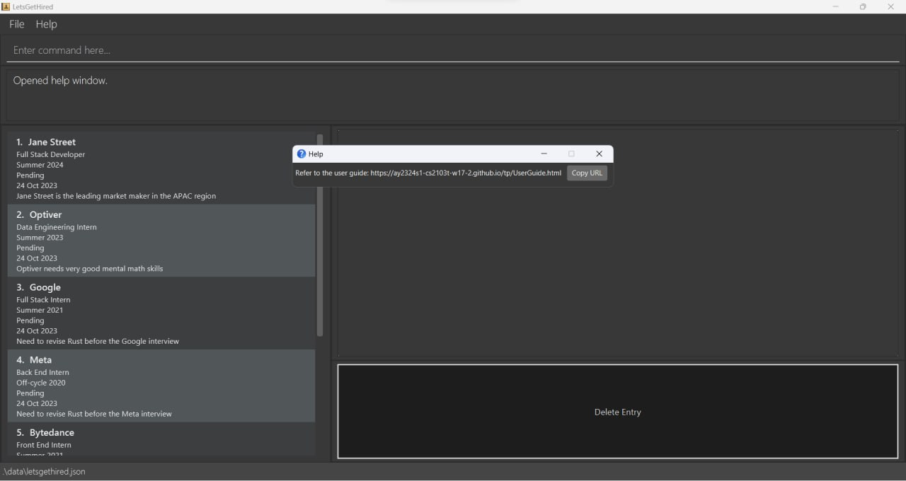
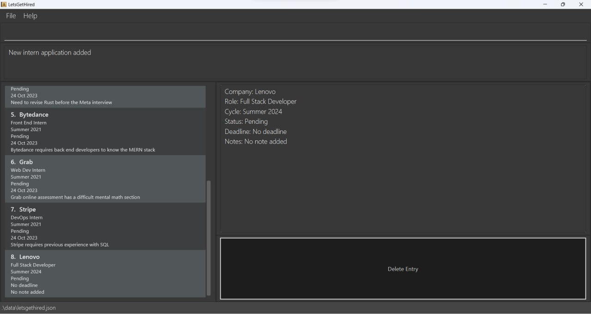
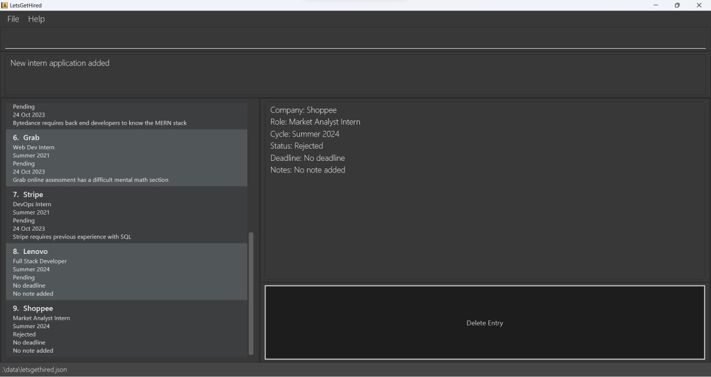
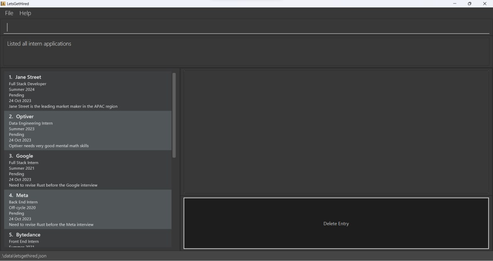
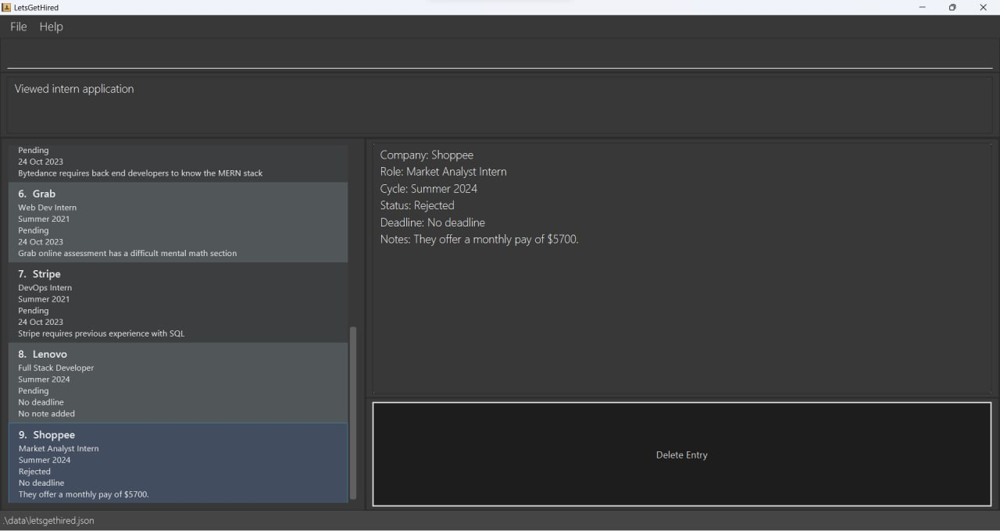
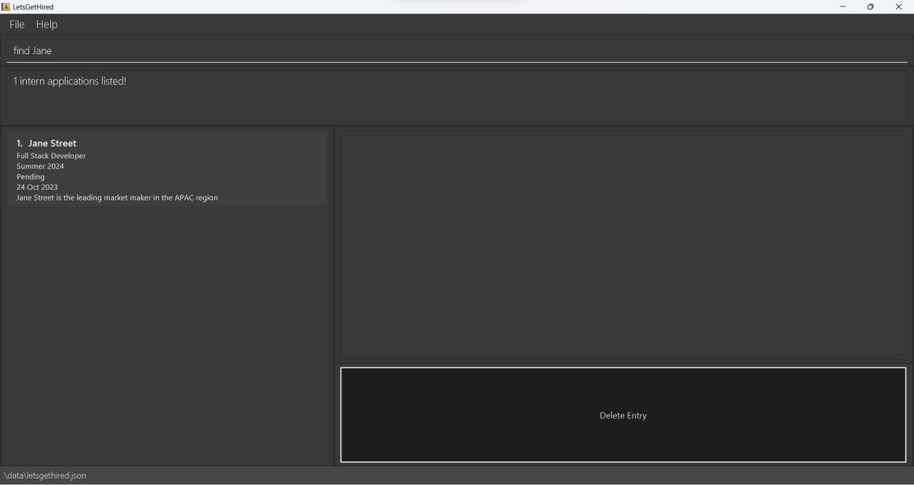
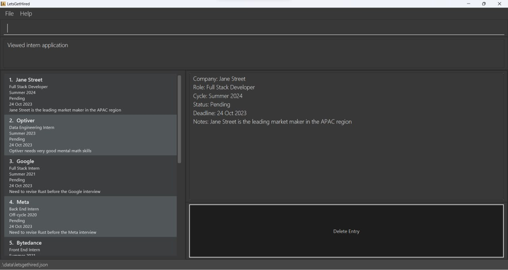
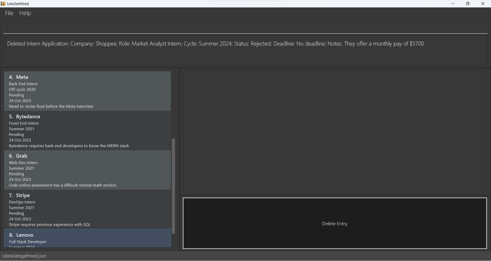

# User Guide

## **Introduction**

**LetsGetHired** is a **desktop app** which provides a **fast and organised way to see internships and its progress**,
optimised for users who prefer a Command Line Interface (CLI) while still having the benefits of a Graphical User Interface (GUI).

### Purpose of the guide
This user guide is designed to help you get started with the LetsGetHired Intern Tracker, a powerful tool for managing your internship applications. Whether you're a tech-savvy student or a professional looking to land that dream internship, this guide is here to assist you every step of the way.

This app is perfect for you if you are a **Computer Science undergraduate student**

This user guide is primarily designed for Computer Science undergraduates currently engaged in the internship finding process. Whether you are seeking you first internship or have prior experience, this guide is tailored to cater to your specific needs.

### Prerequisite knowledge

While this guide is accessible to a broad audience, we assume that you have a basic understanding of the internship-finding process. If you're new to this journey, don't worry! We've got you covered. Feel free to check out these [helpful resources](https://www.techinterviewhandbook.org/software-engineering-interview-guide/) or refer to our [glossary](#glossary) page for additional information to get you up to speed.

Our goal is to make your internship application experience as smooth and successful as possible, regardless of your level of experience. Let's embark on this journey together and make your internship goals a reality.

### Main features

LetsGetHired allows you to add and organise your internship applications. View all applications at a glance, or narrow down your search with filter and search features. LetsGetHired also allows you to attach customized tags and notes, to track any additional information.

<!-- * Table of Contents -->
<page-nav-print />

--------------------------------------------------------------------------------------------------------------------

## **Quick start**

1. Ensure you have Java `11` or above installed in your Computer (from [here](https://www.oracle.com/sg/java/technologies/javase/jdk11-archive-downloads.html) if you do not have it already).

1. Download the latest `letsgethired.jar` from [here](https://github.com/AY2324S1-CS2103T-W17-2/tp/releases).

    

1. Copy the file to the folder you want to use as the _home folder_ for your **LetsGetHired** application.

1. Open a command terminal, `cd` into the folder you put the jar file in, and use the `java -jar letsgethired.jar` command to run the application. A GUI similar to the below should appear in a few seconds. Note how the app contains some sample data.<br>
   
    

1. Here's what you'll see when you start the app for the first time ! We've added some intern applications already. Enter your commands in the **Command Bar**. On the left you'll see a **List View** of all your applications ordered by the date you added them. On the right, the **Select View** shows you a more in depth view of your selected application

1. Type the command in the command box and press `Enter` to execute it. e.g. typing **`help`** and pressing Enter will open the help window. Some example commands you can try:

    * `list` : Lists all internship applications.

    * `add c/Summer r/Full Stack Developer n/John street` : Adds `Summer Internship - Full Stack Developer at John Street` application entry to the internship list

    * `delete 1` : Deletes the first internship application entry shown in the current list.

    * `tag 1 s/Applied` : Updates the status of the 1st internship application entry shown in the current list as `Applied`.

1. Refer to the [Features](#features) below for details of each command.

--------------------------------------------------------------------------------------------------------------------

## Tutorial - Managing Your Internship Applications

In this tutorial, we'll walk you through a typical workflow for using LetsGetHired to manage your internship applications. Imagine you want to add an entry for a software engineering internship at Google for the summer of 2024.

### Step 1: Adding Your Internship

**Context:** You're starting your internship application journey, and you want to add a new entry.

To add your internship, go to the input box and type the following command:
   ```shell
   add n/Google r/Full Stack Developer c/Summer 2024
   ```
This command specifies the company (Google), the role (Full Stack Developer), and the internship details (Summer 2024).

After hitting Enter, your new internship entry will appear in the left panel of the application, allowing you to keep track of your application details effortlessly.

### Step 2: Editing Company Name

**Context:** You realize that you made a mistake in the company name and need to correct it.

To edit the company name, use the `edit` command, followed by the entry number (in this case, it's 1) and the corrected company name:
   ```shell
   edit 1 n/Google Inc
   ```
   This command updates the company name to "Google Inc."

   Always ensure your application details are accurate to avoid confusion in the future.

### Step 3: Updating Application Status

**Context:** You've submitted your application, and you want to update the application status.

To update the status of your internship application, use the `tag` command. For example, to mark your application as "Applied," enter:
   ```shell
   tag 1 s/Applied
   ```
   This command changes the status of the first internship application to "Applied."

   Keeping your application status up to date helps you stay organized and informed.

### Step 4: Adding Notes

**Context:** You want to keep track of additional information about the internship, such as job requirements.

To add notes to your internship entry, use the `note` command, specifying the entry number (1) and providing the relevant details:
   ```shell
   note i/1 Additional information about job requirements and expectations...
   ```
   This command allows you to include any supplementary information you need to remember about the internship, making it a valuable resource when preparing for interviews or follow-ups.

Congratulations! You've successfully managed your internship application using LetsGetHired. These steps demonstrate the core functions of the application, helping you stay organized and informed throughout your internship search journey.

--------------------------------------------------------------------------------------------------------------------

## **Commands**

<box type="info" seamless>

**Notes about the command format:**<br>

* Words in `UPPER_CASE` are the parameters to be supplied by the user.<br>
  e.g. in `add c/CYCLE`, `CYCLE` is a parameter which can be used as `add c/Summer`.

* Items in square brackets are optional.<br>
  e.g. `c/CYCLE [s/STATUS]` can be used as `c/Summer s/Accepted` or as `c/Summer`.

* Parameters can be in any order.<br>
  e.g. if the command specifies `c/CYCLE r/ROLE`, `r/ROLE c/CYCLE` is also acceptable.

* Irrelevant parameters for commands that do not take in parameters (such as `help` and `list`) will be ignored.<br>
  e.g. if the command specifies `help 123`, it will be interpreted as `help`.

* If you are using a PDF version of this document, be careful when copying and pasting commands that span multiple lines as space characters surrounding line-breaks may be omitted when copied over to the application.
  </box>

### Viewing help : `help`

Shows a message explaining how to access the help page.




**Format**: `help`

### Adding internship entry : `add`

Adds an internship application entry to the internship list.

**Format**: `add c/CYCLE r/ROLE n/COMPANY_NAME [s/STATUS]`

**Parameters**:
* `c/CYCLE`: Internship cycle, such as `Summer` or `Winter`
* `r/ROLE`: Internship role, such as `Software Engineering Intern`
* `n/COMPANY_NAME`: Company name, such as `Jane Street` or `Google`
* `s/STATUS`: (optional) Status of your internship application, such as `Applied`, `Accepted`, `Rejected`, etc.

**Examples**:
* `add c/Summer r/Full Stack Developer n/John street`<br>
* `add c/Winter r/Software Engineering Intern n/ACBC s/Applied`<br>
* `add c/Summer r/Data Analyst n/Pineapple s/Rejected`<br>

**Expected Output**:




### Listing all internships : `list`

Shows a list of all the existing internship application entries.

**Format**: `list`

**Expected Output**:


### Viewing a specific internship : `view`

Shows a specific internship application entry and its details.

**Format**: `view INDEX`

**Parameters**:
* `INDEX`: Index of internship application entry to be displayed
    * `INDEX` must be a positive integer, such as, `1`, `2`, `3`, etc.

**Examples**:
* `view 1` shows the first internship application entry (in the list) and its details

**Expected Output**:


### Locating an internship by company: `find`

Finds internship applications whose company name contain any of the given keywords.

**Format**: `find SEARCH_STRING`

**Parameters**:
* `SEARCH_STRING`: Search string to be used to find internship application entry.
    * The search is case-insensitive. e.g `google` will match `Google`
    * Only the company name is searched
    * Partial words will be matched e.g. `Goo` will match `Google`, `JST` will match `Jane Street`

**Examples**:
* `find Google` returns `Google`

**Expected Output**:


### Editing an internship application : `edit`

Edits an internship application in the internship application list.

**Format**: `edit INDEX [n/COMPANY_NAME] [r/ROLE] [c/CYCLE] [s/STATUS]`

**Parameters**:
* `INDEX`: Index of internship application entry to be edited
    * `INDEX` must be a positive integer, such as, `1`, `2`, `3`, etc.
* At least one of the optional fields must be provided.
    * Existing values will be updated to the input values.

**Examples**:
* `edit 1 s/Applied` edits the status of the first internship application entry (in the list) as `Applied`

**Expected Output**:


### Adding a note to a specific internship : `note`

Adds the specified note to an internship application.

**Format**: `note INDEX [i/NOTE]`

**Parameters**:
* `INDEX`: Index of internship application entry to be updated
    * `INDEX` must be a positive integer, such as, `1`, `2`, `3`, etc.
* `i/NOTE`: Note to be added to the internship application

**Examples**:
* `note 1 i/John Street is the leading market maker in the APAC region` adds the note, 'John Street is the leading market maker in the APAC region' to first internship application entry (in the list)

**Expected Output**:


### Deleting an internship application entry : `delete`

Deletes the specified internship application entry from the internship list.

**Format**: `delete INDEX`

**Parameters**:
* `INDEX`: Index of internship application entry to be updated
    * `INDEX` must be a positive integer, such as, `1`, `2`, `3`, etc.

Examples:
* `delete 1` deletes the first internApplication in the status book.

**Expected Output**: 


### Clearing all entries : `clear`

Clears all entries from the internship application list.

Format: `clear`

### Exiting the program : `exit`

Exits the program.

Format: `exit`

### Saving the data

LetsGetHired data are saved in the hard disk automatically after any command that changes the data. There is no need to save manually.

### Editing the data file

LetsGetHired data are saved automatically as a JSON file `[JAR file location]/data/letsgethired.json`. Advanced users are welcome to update data directly by editing that data file.

<box type="warning" seamless>

**Caution:**
If your changes to the data file makes its format invalid, LetsGetHired will discard all data and start with an empty data file at the next run.  Hence, it is recommended to take a backup of the file before editing it.

</box>

--------------------------------------------------------------------------------------------------------------------

## **FAQ**

**Q**: How do I transfer my data to another Computer?<br>
**A**: Install the app in the other computer and overwrite the empty data file it creates with the file that contains the data of your previous LetsGetHired home folder.

--------------------------------------------------------------------------------------------------------------------

## **Known issues**

* **When using multiple screens**, if you move the application to a secondary screen, and later switch to using only the primary screen, the GUI will open off-screen. The remedy is to delete the `preferences.json` file created by the application before running the application again.

--------------------------------------------------------------------------------------------------------------------

## **Command summary**

| Action     | Format, Examples                                            | Examples                                                              |
|------------|-------------------------------------------------------------|:----------------------------------------------------------------------|
| **Add**    | `add c/CYCLE r/ROLE n/COMPANY_NAME [s/STATUS]`              | `add c/Summer r/Full Stack Developer n/John street s/Applied`         |
| **View**   | `view INDEX`                                                | `view 3`                                                              |
| **Edit**   | `edit INDEX [n/COMPANY_NAME] [r/ROLE] [c/CYCLE] [s/STATUS]` | `edit 2 s/Applied`                                                    |
| **Note**   | `note INDEX`                                                | `note 5 i/John Street is the leading market maker in the APAC region` |
| **Delete** | `delete INDEX`                                              | `delete 1`                                                            |
| **List**   | `list`                                                      | `list`                                                                |
| **Help**   | `help`                                                      | `help`                                                                |
| **Clear**  | `clear`                                                     | `clear`                                                               |
| **Exit**   | `exit`                                                      | `exit`                                                                |

## **Glossary**

* **Mainstream OS**: Windows, Linux, Unix, OS-X
* **Internship Entry:** A record or entry in the system that represents information about an internship opportunity. It includes details such as company name, application status, deadlines, and notes.
* **Application Status:** The current stage or status of an internship application.
* **Sample Data:** Pre-populated data used for demonstration purposes, enabling new users to see how the application functions with realistic examples.
