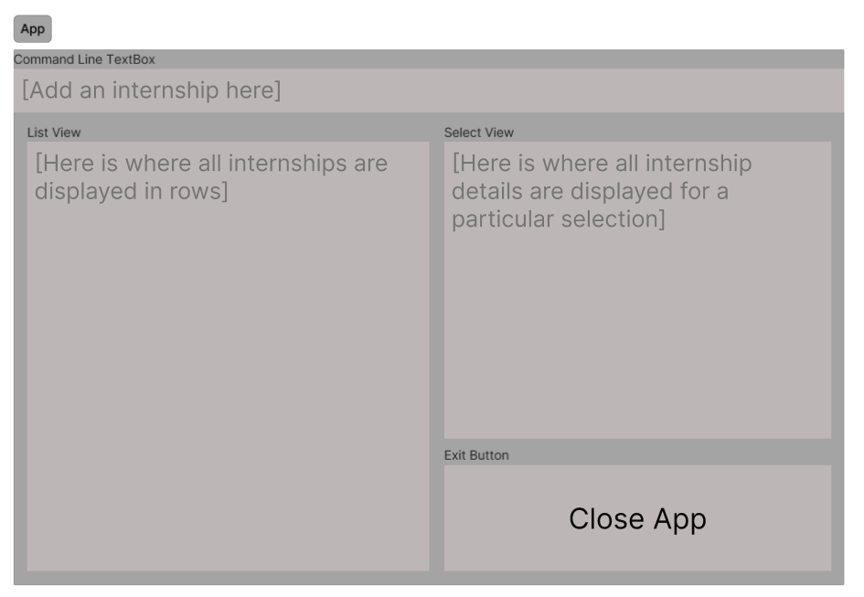

# LetsGetHired User Guide

LetsGetHired is a **desktop app** which provides a **fast and organised way to see internships and its progress**, 
optimised for users who prefer a Command Line Interface (CLI) while still having the benefits of a Graphical User Interface (GUI).

<!-- * Table of Contents -->
<page-nav-print />

--------------------------------------------------------------------------------------------------------------------

## Quick start

1. Ensure you have Java `11` or above installed in your Computer.

1. Download the latest `letsgethired.jar` from [here](https://github.com/AY2324S1-CS2103T-W17-2/tp/releases).

1. Copy the file to the folder you want to use as the _home folder_ for your LetsGetHired application.

1. Open a command terminal, `cd` into the folder you put the jar file in, and use the `java -jar letsgethired.jar` command to run the application. 
   A GUI similar to the below should appear in a few seconds. Note how the app contains some sample data. 
   

1. Type the command in the command box and press `Enter` to execute it. e.g. typing **`help`** and pressing Enter will open the help window. 
   Some example commands you can try:

   * `list` : Lists all internship applications.

   * `add c/Summer r/Full Stack Developer n/John street ` : Adds the following internship application entry to the internship list   `Summer Internship - Full Stack Developer at John Street`

   * `delete 1` : Deletes the 1st internship application entry shown in the current list.

   * `tag 1 s/Applied` : Updates the status of the 1st internship application entry shown in the current list as `Applied`.

1. Refer to the [Features](#features) below for details of each command.

--------------------------------------------------------------------------------------------------------------------

## Features

<box type="info" seamless>

**Notes about the command format:** 

* Words in `UPPER_CASE` are the parameters to be supplied by the user. 
  e.g. in `add c/CYCLE`, `CYCLE` is a parameter which can be used as `add c/Summer`.

* Items in square brackets are optional. 
  e.g. `c/CYCLE [s/STATUS]` can be used as `c/Summer s/Accepted` or as `c/Summer`.

* Parameters can be in any order. 
  e.g. if the command specifies `c/CYCLE r/ROLE`, `r/ROLE c/CYCLE` is also acceptable.

* Extraneous parameters for commands that do not take in parameters (such as `help`, `list`, `exit` and `clear`) will be ignored. 
  e.g. if the command specifies `help 123`, it will be interpreted as `help`.

* If you are using a PDF version of this document, be careful when copying and pasting commands that span multiple lines as space characters surrounding line-breaks may be omitted when copied over to the application.
</box>

### Viewing help : `help`

Shows a message explaining how to access the help page.

**Format**: `help`

### Adding internship entry : `add`

Adds an internship application entry to the internship list.

**Format**: `add c/CYCLE r/ROLE n/COMPANY_NAME [s/STATUS]`

**Parameters**:
* `c/CYCLE`: Internship cycle, such as `Summer` or `Winter`
* `r/ROLE`: Internship role that you applied to
* `n/COMPANY_NAME`: Name of the company that you applied to 
* `s/STATUS`: (optional) Status of your internship application, such as `Applied`, `Accepted`, `Rejected`, etc.

**Examples**:
* `add c/Summer r/Full Stack Developer n/John street`
* `add c/Winter r/Software Engineering Intern n/ACBC s/Applied`
* `add c/Summer r/Data Analyst n/Pineapple s/Rejected`

**Expected Output**:
* Success
  * The following internship application entry is added into the list:   `Summer Internship - Full Stack Developer at John Street`
* Failure
  * Wrong parameter:  `The following parameter <parameter_name> is in the wrong format - please input in the correct format`
  * Missing parameter:  `The following parameter <parameter_name> is missing - please input in the correct format`

### Listing all internships : `list`

Shows a list of all the existing internship application entries.

**Format**: `list`

**Expected Output**:
* Success
  * The following internship application entry is displayed in the screen:   
    * `Summer Internship - Full Stack Developer at John Street `
    * `Winter Internship - Software Engineering Intern at ACBC`
    * `Summer Internship - Data Analyst at Pineapple`
* Failure
  * Unknown command: `Unknown Command`

### Viewing a specific internship : `view`

Shows a specific internship application entry and its details.

**Format**: `view INDEX`

**Parameters**:
* `INDEX`: Index of internship application entry to be displayed
  * `INDEX` must be a positive integer, such as, `1`, `2`, `3`, etc.

**Examples**:
* `view 1` shows the first internship application entry (in the list) and its details

**Expected Output**:
* Success

* Failure
  * Wrong parameter:  `The following parameter INDEX is in the wrong format - please input in the correct format`
  * Missing parameter:  `The following parameter INDEX is missing - please input in the correct format`
  * Index out of bound:   `The following parameter INDEX provided is out of bound`

### Updating an internship status : `tag`

Updates an internship application entry with the specified status.

**Format**: `tag INDEX [s/STATUS]`

**Parameters**:
* `INDEX`: Index of internship application entry to be updated
  * `INDEX` must be a positive integer, such as, `1`, `2`, `3`, etc.
* `s/STATUS`: (optional) Status of internship application
  * You can remove existing status by omitting the `STATUS` parameter 

**Examples**:
* `tag 1 s/Applied` updates the status of the first internship application entry (in the list) as `Applied`

**Expected Output**:
* Success
  
* Failure
  * Wrong parameter:  `The following parameter INDEX is in the wrong format - please input in the correct format`
  * Missing parameter:  `The following parameter INDEX is missing - please input in the correct format`
  * Index out of bound:   `The following parameter INDEX provided is out of bound`

### Deleting an internship application entry : `delete`

Deletes the specified internship application entry from the internship list.

**Format**: `delete INDEX`

**Parameters**:
* `INDEX`: Index of internship application entry to be updated
  * `INDEX` must be a positive integer, such as, `1`, `2`, `3`, etc.

Examples:
* `delete 1` deletes the first internApplication in the status book.

**Expected Output**:
* Success
  * The following internship application entry is deleted:  
    * `Summer Internship - Full Stack Developer at John Street `
* Failure
  * Wrong parameter:  `The following parameter INDEX is in the wrong format - please input in the correct format`
  * Missing parameter:  `The following parameter INDEX is missing - please input in the correct format`
  * Index out of bound:   `The following parameter INDEX provided is out of bound`

### Saving the data

LetsGetHired data are saved in the hard disk automatically after any command that changes the data. There is no need to save manually.

### Editing the data file

LetsGetHired data are saved automatically as a JSON file `[JAR file location]/data/letsgethired.json`. Advanced users are welcome to update data directly by editing that data file.

<box type="warning" seamless>

**Caution:**
If your changes to the data file makes its format invalid, LetsGetHired will discard all data and start with an empty data file at the next run.  Hence, it is recommended to take a backup of the file before editing it.
</box>

--------------------------------------------------------------------------------------------------------------------

## FAQ

**Q**: How do I transfer my data to another Computer? 
**A**: Install the app in the other computer and overwrite the empty data file it creates with the file that contains the data of your previous LetsGetHired home folder.

--------------------------------------------------------------------------------------------------------------------

## Known issues

1. **When using multiple screens**, if you move the application to a secondary screen, and later switch to using only the primary screen, the GUI will open off-screen. The remedy is to delete the `preferences.json` file created by the application before running the application again.

--------------------------------------------------------------------------------------------------------------------

## Command summary

| Action     | Format, Examples                                                                                                        |
|------------|-------------------------------------------------------------------------------------------------------------------------|
| **Add**    | `add c/CYCLE r/ROLE n/COMPANY_NAME [s/STATUS]`   e.g., `add c/Summer r/Full Stack Developer n/John street s/Applied` |
| **View**   | `view INDEX`  e.g., `view 3`                                                                                         |
| **Tag**    | `tag INDEX`  e.g.,`tag 2 s/Applied`                                                                                  |
| **Delete** | `delete INDEX`  e.g., `delete 1`                                                                                     |
| **List**   | `list`                                                                                                                  |
| **Help**   | `help`                                                                                                                  |
